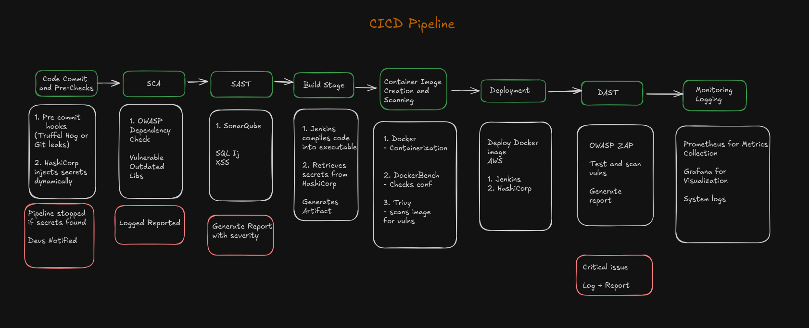

# Zero Trust Architecture Implementation with Secure CI/CD Pipeline

## Table of Contents
- [Overview](#overview)
- [Architecture Overview](#architecture-overview)
- [Prerequisites](#prerequisites)
- [Installation](#installation)
- [Pipeline Structure](#pipeline-structure)
- [Security Features](#security-features)
- [Monitoring](#monitoring)
- [Configuration](#configuration)
- [Troubleshooting](#troubleshooting)
- [Contributing](#contributing)
- [License](#license)

## Overview

This repository implements a Zero Trust Architecture (ZTA) approach with a comprehensive CI/CD pipeline, incorporating multiple layers of security scanning and continuous monitoring capabilities. The pipeline ensures secure deployment while maintaining continuous security assessment of the infrastructure.

## Architecture Overview



## Prerequisites

### Required Software
- Jenkins server (LTS version recommended)
- Docker Engine (version 20.10+)
- Python 3.8+
- HashiCorp Vault
- SonarQube
- EC2 instance for deployment

### Jenkins Plugins
- Pipeline
- Docker Pipeline
- HashiCorp Vault
- SonarQube Scanner
- OWASP Dependency-Check

## Installation

1. Clone the repository:
```bash
git clone https://github.com/yourusername/zta-pipeline.git
cd zta-pipeline
```

2. Configure Jenkins credentials:
```bash
# Example vault configuration in Jenkins
Configuration:
URL: http://vault.example.com
Credential ID: vault-token
```

3. Set up HashiCorp Vault secrets:
```bash
# Required secret paths
secret/github
secret/dockerhub
secret/sonarqube
secret/ssh
secret/ec2-host
```

4. Install dependencies:
```bash
python3 scripts/install_dependencies.py
```

## Pipeline Structure

### Stage 1: Code Checkout & Setup
```groovy
stage('Code Checkout & Setup') {
    stages {
        stage('Checkout Infrastructure Code')
        stage('Checkout Application Code')
        stage('Install Dependencies')
    }
}
```

### Stage 2: Static Analysis
```groovy
stage('Static Analysis') {
    stages {
        stage('SonarQube Analysis')
        stage('Dependency Check')
    }
}
```

### Stage 3: Container Build & Security
```groovy
stage('Container Build & Security') {
    stages {
        stage('Build Docker Image')
        stage('Container Security Scan')
    }
}
```

### Stage 4: Deployment
```groovy
stage('Deployment') {
    stages {
        stage('Push to Registry')
        stage('Deploy to EC2')
    }
}
```

## Security Features

Our pipeline implements multiple security layers:

1. **Secrets Management**
   - HashiCorp Vault integration
   - Secure credential handling
   - Dynamic secret rotation

2. **Static Analysis**
   - SonarQube code quality checks
   - OWASP Dependency scanning
   - Custom security rules

3. **Container Security**
   - Trivy vulnerability scanning
   - Docker Bench Security compliance
   - Image signing and verification

4. **Dynamic Testing**
   - OWASP ZAP security scanning
   - Network port scanning
   - SSL/TLS verification

## Monitoring

### Prometheus Configuration
```yaml
global:
  scrape_interval: 15s
  evaluation_interval: 15s

scrape_configs:
  - job_name: 'zta-application'
    static_configs:
      - targets: ['localhost:8080']
```

### Grafana Dashboards
- Security Metrics Dashboard
- Container Health Monitoring
- Network Traffic Analysis
- Vulnerability Tracking

## Configuration

### Environment Variables
```bash
SONAR_SCANNER_HOME=<path_to_sonar_scanner>
DOCKER_IMAGE=zta
DOCKER_TAG=v${BUILD_NUMBER}
SONAR_HOST_URL=http://localhost:9000
APP_CODE_DIR=app
```

### Jenkins Pipeline Configuration
```groovy
pipeline {
    agent any
    environment {
        // Environment configurations
    }
    stages {
        // Pipeline stages
    }
}
```

## Troubleshooting

Common issues and solutions:

1. **Jenkins Pipeline Failures**
   - Check Jenkins console output
   - Verify Vault token permissions
   - Ensure Docker daemon is running

2. **Security Scan Issues**
   - Review scan configurations
   - Check network connectivity
   - Verify tool installations

3. **Deployment Problems**
   - Validate EC2 instance status
   - Check SSH key permissions
   - Verify Docker registry access

## Contributing

We welcome contributions! Please follow these steps:

1. Fork the repository
2. Create a feature branch (`git checkout -b feature/amazing-feature`)
3. Commit your changes (`git commit -m 'Add amazing feature'`)
4. Push to the branch (`git push origin feature/amazing-feature`)
5. Open a Pull Request

## License

This project is licensed under the MIT License - see the [LICENSE.md](LICENSE.md) file for details.

---

**Note**: For security reasons, ensure all sensitive information is stored in HashiCorp Vault and never committed to the repository.
